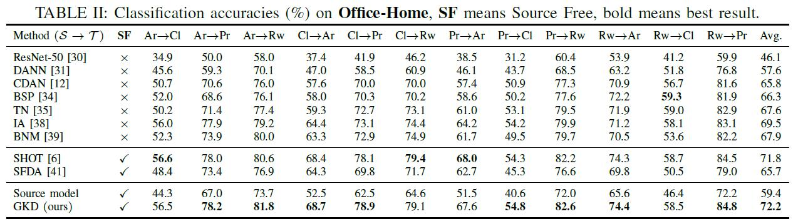

# GKD

Code (pytorch) for ['Model Adaptation through Hypothesis Transfer with Gradual Knowledge Distillation']() on Office-31, Office-Home, VisDA-C. This paper has been accepted by IROS2021.

### Preliminary

You need to download the [Office-31](https://drive.google.com/file/d/0B4IapRTv9pJ1WGZVd1VDMmhwdlE/view), [Office-Home](https://drive.google.com/file/d/0B81rNlvomiwed0V1YUxQdC1uOTg/view), [VisDA-C](https://github.com/VisionLearningGroup/taskcv-2017-public/tree/master/classification) dataset,  modify the path of images in each '.txt' under the folder './data/'.

The experiments are conducted on one GPU (NVIDIA RTX TITAN).

- python == 3.7.3
- pytorch ==1.6.0
- torchvision == 0.7.0

### Training and evaluation

1. First training model on the source data,  Office-Home dataset is shown here.

> ~/anaconda3/bin/python gkd_source.py --trte val --output ckpsmix2020r0/source/ --da uda --gpu_id 0 --dset office-home --max_epoch 50 --s 0 --seed 2020

2. Then adapting source model to target domain, with only the unlabeled target data.

> ~/anaconda3/bin/python gkd_target.py --cls_par 0.05 --da uda --dset office-home --gpu_id 0 --s 0 --t 1 --output_src ckpsmix2020r0/source/ --output ckpsmix2020r0/target_mix/ --seed 2020

### Results

**The results of GKD is display under the folder './result/'.**

### Acknowledgement

The codes are based on [SHOT (ICML 2020, also source-free)](https://github.com/tim-learn/SHOT).

### Contact

- tntechlab@hotmail.com

